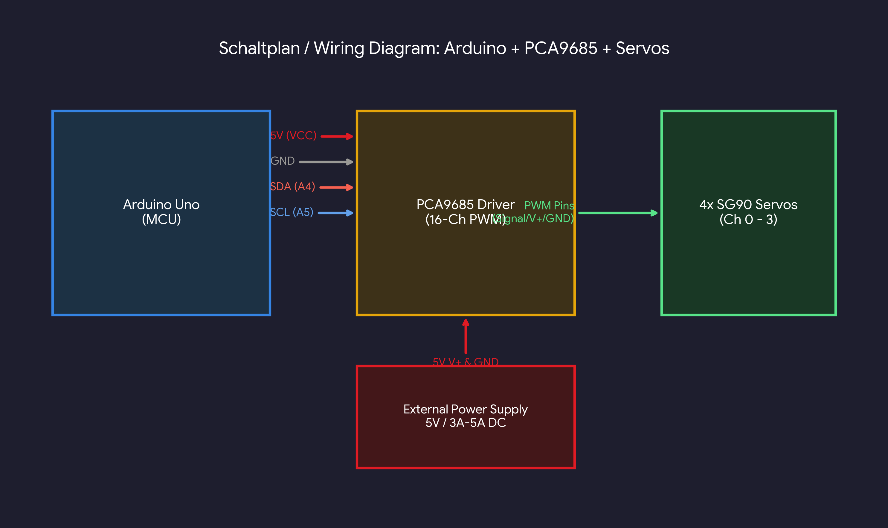

# Robot Arm PCA9685 Controller

An Arduino Uno based multi-servo robot arm controller utilizing the PCA9685 16-channel PWM servo driver. Features single-button toggle functionality to cycle through and select active servos.

## Features
- Controls multiple standard PWM servos via I2C (PCA9685 driver).
- Single-button input interface to cycle through active servo selection.
- Smooth servo positional updates.

## Hardware Requirements
- Arduino Uno
- PCA9685 PWM Servo Driver
- Standard Servos (e.g., SG90 or MG996R)
- Push Button & Pull-down Resistor
- External 5V Power Supply for Servos

## Wiring Diagram
- **PCA9685 VCC** -> Arduino 5V
- **PCA9685 GND** -> Arduino GND
- **PCA9685 SDA** -> Arduino A4
- **PCA9685 SCL** -> Arduino A5
- **Button Pin** -> Arduino Digital Pin 2 (with pull-down)

## Setup & Installation
1. Clone this repository:
   ```bash
   git clone [https://github.com/](https://github.com/)<your-username>/robot-arm-pca9685-controller.git


## Wiring Diagram


